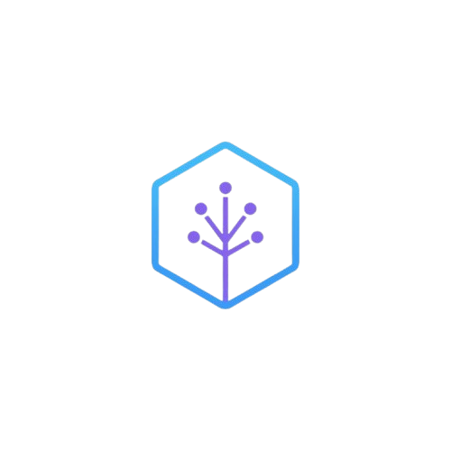

# ⬡ astral.nvim

> **Navegador de diff semántico con AST para Neovim.**

<p align="center">
    
</p>

🌐 [English](README.md) | [Español](README.es.md)

---

Navega tus cambios de código como **eventos semánticos** — no como bloques de líneas.
En lugar de ver qué líneas cambiaron, ves qué *conceptos* cambiaron:
firmas de funciones, nuevos símbolos, bloques movidos, cambios de dependencias.

## El Problema

`git diff` te muestra *líneas*. `difftastic` se acerca, pero es un visor pasivo.
No puedes navegarlo, actuar sobre él, ni construir una sesión de revisión desde dentro de tu editor.

**astral.nvim** aporta la capa editorial que faltaba: controlado por teclado, 100% local, sin nube, sin IA — solo tú y tu código.

## Características

- 🔍 **Diff con conocimiento de AST** — entiende la estructura de tu código, no solo texto
- 📋 **Lista de eventos semánticos** — ve `firma de función cambiada`, no `línea 42 modificada`
- ⌨️ **Navegación por teclado** — salta entre eventos con `<A-n>` / `<A-p>`
- 🏷️ **Marcado de eventos** — persistencia de sesión entre reinicios de Neovim
- 📊 **Línea de tiempo visual** — reporte HTML local con filtros y búsqueda, sin servidor, sin build
- 🔭 **Integración con Telescope** — búsqueda difusa a través de eventos semánticos
- 🔒 **100% local** — sin nube, sin telemetría, sin IA
- 🛡️ **Protección XSS** — todos los datos de usuario se escapan antes de renderizar en la línea de tiempo

## Requisitos

- Neovim >= 0.9.0
- Python >= 3.10
- Git

## Instalación

Usando [lazy.nvim](https://github.com/folke/lazy.nvim):

```lua
{
  "xd0pa/astral.nvim",
  config = function()
    require("astral").setup()
  end,
}
```

Después de instalar, ejecuta este comando dentro de Neovim para instalar las dependencias de Python:

```
:AstralInstall
```

Esto creará automáticamente un entorno virtual e instalará todos los paquetes
de Python requeridos. Solo necesitas ejecutarlo una vez.

## Lenguajes Soportados

| Lenguaje | Extensión | Parser |
|----------|-----------|--------|
| Python | `.py` | LibCST |
| JavaScript | `.js`, `.jsx` | tree-sitter |
| TypeScript | `.ts`, `.tsx` | tree-sitter |
| Lua | `.lua` | tree-sitter |

## Uso

Abre cualquier archivo rastreado por git y ejecuta:

```
:SemanticDiff
```

Esto hace diff del archivo actual contra `HEAD~1` por defecto.
También puedes pasar una referencia de git específica:

```
:SemanticDiff HEAD~3
:SemanticDiff main
```

## Comandos

| Comando | Descripción |
|---------|-------------|
| `:SemanticDiff [ref]` | Ejecutar diff semántico contra una referencia git (por defecto: `HEAD~1`) |
| `:AstralInstall` | Instalar dependencias de Python en el directorio de datos de Neovim |
| `:AstralTimeline` | Abrir línea de tiempo visual en el navegador con filtros y búsqueda |
| `:AstralTelescope` | Buscar eventos semánticos con Telescope |

## Atajos de Teclado

| Tecla | Acción |
|-----|--------|
| `<A-n>` | Saltar al siguiente evento semántico |
| `<A-p>` | Saltar al evento semántico anterior |
| `<CR>` | Saltar a la ubicación del evento (dentro de la ventana de astral) |
| `q` | Cerrar el panel de astral |

## Configuración

```lua
require("astral").setup({
  default_ref = "HEAD~1",    -- Referencia git por defecto para comparar
  ui_style = "split",        -- Estilo de presentación de la UI
  python_path = nil,         -- Ruta personalizada al intérprete de Python (nil = auto-detectar)
  keymaps = {
    next_event = "<A-n>",    -- Siguiente evento semántico
    prev_event = "<A-p>",    -- Evento semántico anterior
    close      = "q",        -- Cerrar panel de astral
  },
})
```

## Arquitectura

astral.nvim usa una arquitectura **híbrida Lua + Python**:

```
astral.nvim/
├── lua/astral/          # Capa Lua (UI, config, sesión, navegación)
│   ├── init.lua         # Punto de entrada, configuración de comandos
│   ├── config.lua       # Valores por defecto de configuración
│   ├── bridge.lua       # ÚNICO archivo que llama al subproceso de Python
│   ├── ui.lua           # Presentación en ventana flotante
│   ├── navigator.lua    # Navegación de eventos y atajos
│   ├── session.lua      # Persistencia de sesión (archivo .astral)
│   └── telescope.lua    # Integración con Telescope
├── python/              # Motores de diff AST en Python
│   ├── astral_engine.py # Punto de entrada CLI
│   ├── ast_diff_python.py  # Diff de Python basado en LibCST
│   ├── ast_diff_js.py      # Diff de JS/TS con tree-sitter
│   └── ast_diff_lua.py     # Diff de Lua con tree-sitter
├── web/                 # Recursos web estáticos
│   └── timeline.html    # Plantilla de línea de tiempo (renderizada con datos de sesión)
├── doc/                 # Documentación de ayuda de Neovim
├── tests/               # Tests unitarios para motores de diff
└── skills/              # Skills de IA para convenciones del proyecto
```

### Cómo Funciona

1. **Capa Lua** detecta el archivo actual y la referencia git
2. **Bridge** lanza un subproceso de Python con la ruta del archivo y la referencia
3. **Motor Python** obtiene la versión anterior vía `git show`, parsea ambas versiones con el parser AST apropiado, y retorna eventos semánticos como JSON
4. **Capa UI** muestra los eventos en una ventana flotante con navegación
5. **Sesión** se guarda en `.astral` en la raíz del git para persistencia

## Línea de Tiempo

El comando `:AstralTimeline` genera un reporte HTML local con:

- **Botones de filtro** — muestra solo eventos ADDED, REMOVED o MODIFIED
- **Campo de búsqueda** — filtra eventos por nombre o descripción
- **Diseño responsive** — funciona en móvil y escritorio
- **Content Security Policy** — previene XSS y carga de recursos externos
- **Tema Tokyo Night** — consistente con la estética de Neovim

## Seguridad

astral.nvim está diseñado para ser completamente local y seguro:

- **Sin llamadas de red** — todo el procesamiento ocurre localmente
- **Prevención de XSS** — todos los datos controlados por el usuario se escapan antes de renderizar
- **Protección contra inyección de comandos** — todos los argumentos de shell se escapan correctamente
- **Sin telemetría** — cero datos salen de tu máquina
- **Sin llamadas a IA/LLM** — sin dependencias de APIs externas

Ver [SECURITY.md](SECURITY.md) para la política de seguridad completa.

## Estado

> ⚠️ Este plugin está en desarrollo temprano. Se esperan cambios incompatibles.

Etapa actual: **v0.1.0**

## Hoja de Ruta

- [x] Motor de diff semántico principal (Python)
- [x] UI de ventana flotante en Neovim
- [x] Navegación de eventos con `<CR>`
- [x] Atajos para ciclar entre eventos
- [x] Persistencia de sesión (archivo `.astral`)
- [x] Auto-carga de sesión al inicio
- [x] Soporte multi-lenguaje (Python, JS, TS, Lua)
- [x] Línea de tiempo visual (`web/timeline.html`)
- [x] Integración con Telescope
- [x] Filtros y búsqueda en la línea de tiempo
- [x] Reforzamiento de seguridad (prevención XSS, sanitización de entrada)
- [ ] Soporte para Go
- [ ] Diff a nivel de clase y método
- [ ] Diff contra cualquier rama
- [ ] Vista de diff en línea

## Contribuir

Ver [CONTRIBUTING.md](CONTRIBUTING.md) para las guías sobre cómo contribuir.

## Licencia

MIT — ver [LICENSE](LICENSE) para más detalles.
